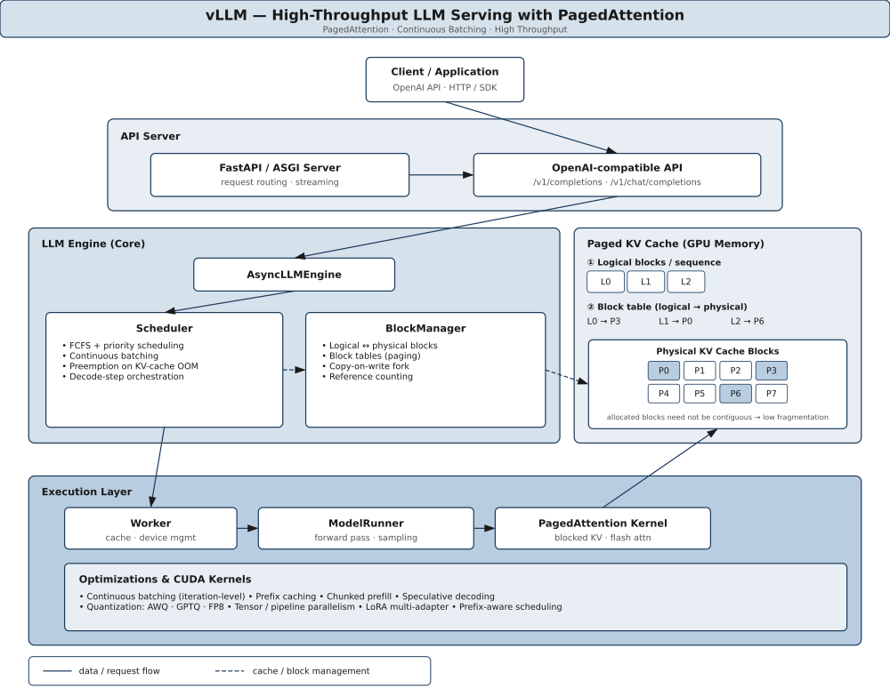
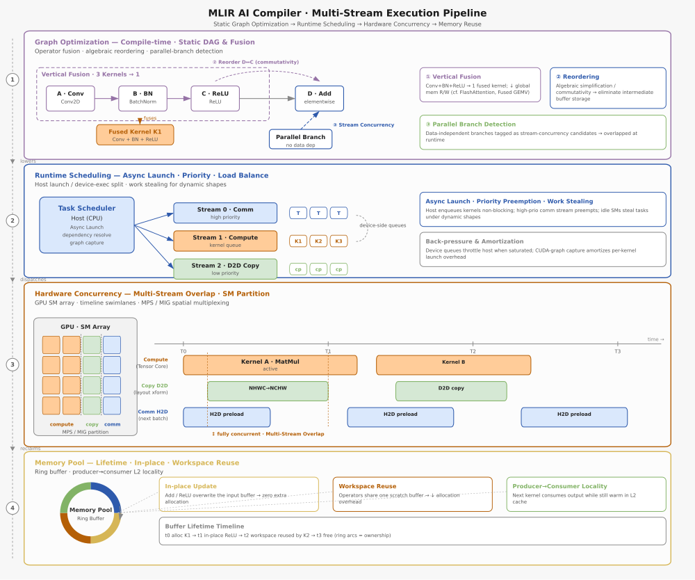
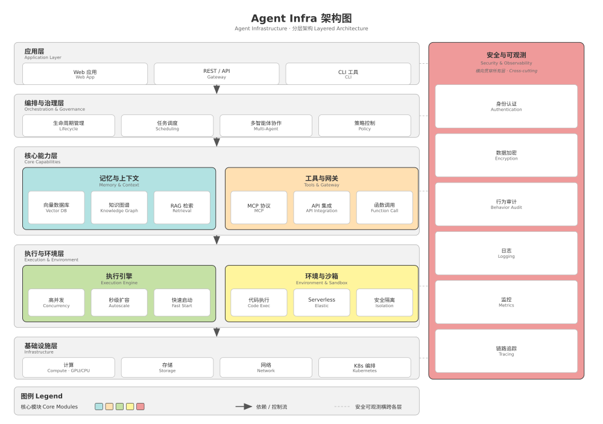

# architecture-drawer

一个面向 [Claude Code](https://code.claude.com)、Codex、Open Code、Pi Agent 等 AI 编程助手的 Skill：把系统架构的文字描述变成**可编辑的 PowerPoint 架构图**。


[English](README.md) · 简体中文

---

## 这是什么

把架构的**文字描述**变成**可编辑的 PPT 架构图**：Agent 根据你的描述生成 SVG，自动验证布局质量，再导出为原生 PowerPoint 形状。

### 与直接出图工具的区别

| | 本项目 | Nano Banana / GPT-Image 等 |
|---|---|---|
| 产出 | **可编辑 PPT**（每个形状可拖拽、改色、改字） | 扁平化图片 |
| 可控性 | 高（代码生成，可精确调整） | 低（提示词驱动，结果难复现） |
| 后续修改 | 在 PPT 里直接微调 | 重新生成 |
| 成本 | 低 | 高（按图计费） |

## 样例展示

下列架构图均由 skill 完全根据文本描述生成，并经 13 维评估器打分（每张 ≥76/100）。它们同时作为 `evals/` 下的回归测试用例。

### vLLM —— 高吞吐 LLM 推理服务（PagedAttention）



六层请求流水线（客户端 → API 服务 → 引擎 → 分页 KV 缓存 → 执行层 → 优化）。实线 = 数据流；虚线 = 缓存/块管理。*S1 单色蓝方案。*

### MLIR AI 编译器 —— 多流执行流水线



4 层 × 多列矩阵（图优化 → 变换 → 降级 → 代码生成），含垂直融合分组与并发多流重叠时间轴。*8 色分类配色。*

### Agent 基础设施 —— 分层架构



五个水平层（应用 → 编排 → 核心能力 → 执行 → 基础设施）+ 横切的安全/可观测带。中英双语标签。*中性灰 + 5 个着色核心模块。*

## 最佳实践

1. **先想清楚架构的文字版描述。** 在写代码之前，用自然语言把架构讲清楚——分几层、每层有哪些组件、它们之间怎么连接、有没有特殊标注。一份清晰的文字描述（如 `evals/*/input.md` 中的规格）是高质量图表最大的前提。对于开源项目，可以利用 deepwiki 来生成系统架构的文字描述。
2. **让 skill 自动生成。** 将系统架构文字描述提交给 skill，让它生成初始 `gen.py` 和 SVG。评估器会自动捕获重叠、连接错位和交叉等问题。
3. **skill 自动审查分数。** 如果分数 ≥80，说明图表结构合理。如果 <80，Agent 能自动用 `auto_refine` 或多轮 LLM 修正（`--llm-iter`）自动修复布局问题。
4. **导出 PPTX 做最终润色。** 运行 `svg_to_pptx()` 获得可编辑的 PowerPoint 文件。在那里调整配色、字体、箭头和布局以匹配品牌或出版风格——这些属于展示层，而非生成器代码的工作。

建议的工作流：先和 DeepWiki 或 Agent 多轮讨论，得出一份清晰的系统架构文字描述，再用本 Skill 快速生成一版 PPTX 架构图，最后在 PPT 里按需微调配色、文字等细节。

## 安装

### Claude Code（插件市场）

本项目已上架 [Claude Code 插件市场](https://code.claude.com/docs/en/plugin-marketplaces)。添加并安装：

```
/plugin marketplace add Andy1314Chen/architecture-drawer
/plugin install architecture-drawer@architecture-drawer
```

或通过 CLI：

```bash
claude plugin marketplace add Andy1314Chen/architecture-drawer
claude plugin install architecture-drawer@architecture-drawer
```

使用 `--scope project`（通过版本控制共享）或 `--scope local`（gitignored）。默认是 `user`。

### Codex CLI

> Codex CLI 同样支持 [Agent Skills](https://agentskills.io) 目录结构。

将 skill 目录复制到 Codex 的 skills 目录（通常位于 `~/.codex/skills/`）：

```bash
cp -r plugins/architecture-drawer/skills/architecture-drawer ~/.codex/skills/architecture-drawer
```

也可以项目级安装（推荐）：

```bash
mkdir -p .codex/skills
cp -r plugins/architecture-drawer/skills/architecture-drawer .codex/skills/
```

安装后，在 Codex CLI 中通过指令使用：

```
> Please draw the architecture of vLLM and export to PPTX
```

Codex 会自动读取 `SKILL.md` 中的工作流规范并执行生成 → 评估 → 修正的完整流程。

### 其他 Agent 平台（Gemini CLI、Cursor、Copilot）

每个 skill 都是独立的 [Agent Skills spec](https://agentskills.io) 目录。复制到对应平台的 skills 目录即可：

| 平台 | 默认 skills 路径 |
|---|---|
| Gemini CLI | `~/.gemini/skills/` |
| Cursor (@rules) | `.cursorrules` 或 `cursor/skills/` |
| Copilot CLI | 按平台指引配置 |

```bash
cp -r plugins/architecture-drawer/skills/architecture-drawer .agents/skills/architecture-drawer
```

## 依赖

Agent 生成的 `gen.py` 会导入 skill 内的三个纯 Python 模块（`svg_utils.py`、`evaluator.py`、`svg2pptx.py`）。你无需手写这些代码——Agent 会完成。只需安装以下依赖，生成的图表就能渲染和导出：

| 依赖 | 用途 | 安装 |
|---|---|---|
| `python-pptx >= 1.0` | PPTX 导出（`svg2pptx.py`） | `pip install python-pptx` |
| `rsvg-convert` | PNG 栅格化（`rasterize_svg`） | `apt install librsvg2-bin` / `brew install librsvg` |
| `pytest >= 8` | 运行测试套件 | `pip install pytest` |


## 测试

测试套件分层设计，每层成本低、确定性强、覆盖不同的失败模式：

| 层级 | 命令 | 门禁内容 | 是否在 CI |
|------|------|---------|-----------|
| **确定性回归** | `pytest` | 每个 `evals/<name>/gen.py` 分数 ≥ 其阈值且匹配 golden SVG | ✅ 总是 |
| **规范合规** | `pytest` | `SKILL.md` frontmatter、name↔目录、相对路径引用、核心脚本齐全 | ✅ 总是 |
| **文档 ↔ API 漂移守卫** | `pytest` | `SKILL.md`/`references/*.md` 中所有 `drawer.<m>(` 都存在于 `SVGDrawer`；公共 API 可导入 | ✅ 总是 |
| **LLM 重放**（协议 A） | `pytest --llm-replay` | 仅凭 `input.md`+`SKILL.md`（不含 golden）重新生成 `gen.py`，迭代修正，断言分数 ≥80 | 每夜 / 本地 |
| **Agent 重放**（协议 B） | `pytest --agent-replay` | 把 skill 安装进无泄漏沙箱，让 **Pi 编码 Agent** 自主编写 `gen.py`，断言分数 ≥80 + 完整的 SVG/PPTX/PNG 产物三元组 | 每夜 / 本地 |

Agent 重放层最贴近真实使用：skill 被*安装*（绝非内联），真实 Agent 通过其原生 skill 机制发现它，而 harness——而非 Agent——确定性重跑产出的 `gen.py`。它需要 [`pi`](https://pi.dev) CLI 与一个 provider key，后端接线在 `tests/agent_backends.py`。选项：`--agent-iter N` 限定无状态修正轮数（默认 3），`--agent-eval <name>` 只跑一个用例以便低成本调试（名称无匹配时会显式报错而非静默跳过），`--agent-keep` 把每个用例的产物（Agent 写的 `gen.py` + SVG/PNG/PPTX + `score_report.txt`）保留到 `output/agent_replay/<name>/` 供复盘（已 gitignore）。

## 仓库结构

```
architecture-drawer/
├── .claude-plugin/marketplace.json              # Claude Code 插件市场注册表
├── plugins/architecture-drawer/
│   ├── .claude-plugin/plugin.json               # 插件清单
│   └── skills/architecture-drawer/
│       ├── SKILL.md                             # Agent 可读的工作流规范
│       ├── scripts/                             # svg_utils.py · evaluator.py · svg2pptx.py
│       ├── references/design_specs.md           # 4 套预设配色方案（S1–S4）
│       ├── evals/                               # 8 个回归测试用例（7 架构 + 1 流程图，每个含 gen.py）
│       └── assets/
├── tests/                                       # pytest：分层回归（见“测试”）
│   ├── conftest.py                              # fixtures、阈值、评分助手、CLI 选项
│   ├── agent_backends.py                        # Pi 编码 Agent 后端 + 无泄漏沙箱构建器
│   ├── test_regression.py                       # 确定性质量+快照；可选 LLM 重放
│   ├── test_skill_spec.py                       # Agent Skills 规范合规
│   ├── test_doc_api.py                          # 文档 ↔ API 漂移守卫（常开）
│   ├── test_agent_replay.py                     # 可选真实 Agent 重放（协议 B）
│   └── golden/*.svg                             # 快照基线
└── examples/                                    # 生成-评估-导出循环的最小示例
```


## 社区

感谢 [LINUX DO](https://linux.do) 社区。项目在社区分享后获得了更多关注、交流和真实反馈，这些讨论帮助我持续发现问题并完善 architecture-drawer。

## 鸣谢

本项目几何/连接检测部分借鉴了以下开源项目（均深入研究了其参考文档和验证实现）：

- **[ink-graph](https://github.com/qaz1230sp/ink-graph)**：箭头被节点遮挡、边穿节点、扇出对齐、标记尺寸、枢纽节点等参考。
- **[fireworks-tech-graph](https://github.com/yizhiyanhua-ai/fireworks-tech-graph)**：构图质量合约、碰撞检测、语义角色、变换矩阵累积、「评估而非断言」理念。
- **[svg-animations](https://github.com/supermemoryai/skills)**：SMIL/CSS 动画基础。
- **[svg-design](https://github.com/tryopendata/skills)**：原生图元、严格 XML 规范等约定。
- **[svg2pptx](https://github.com/benouinirachid/svg2pptx)**（原项目）：PPTX 导出模块的架构蓝图。

完整致谢见 [`SKILL.md`](plugins/architecture-drawer/skills/architecture-drawer/SKILL.md)。

## 协议

MIT — 详见 [LICENSE](LICENSE)。
