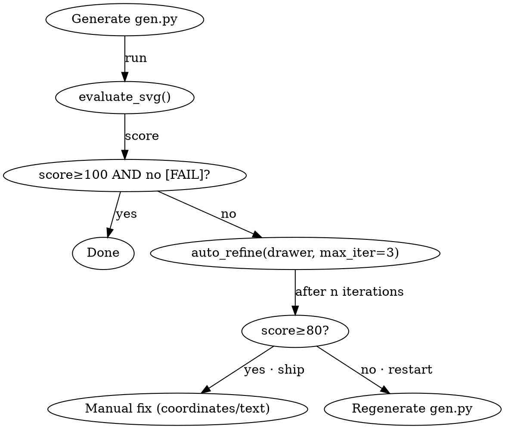

# SVG Architecture Drawer (Smart Version)

This Skill converts complex technical descriptions into structured SVG architecture diagrams. It integrates layout constraints, collision detection, **connection/arrow connectivity validation**, and quality evaluation, automatically identifying and guiding the correction of layout errors.
The script directory (referred to as `$SKILL` below) is this skill's own
`scripts/` folder. From a generator script that lives next to its artifacts,
resolve it relative to the script's own location (never hard-code an absolute
path, which breaks on other machines):

```python
import os, sys
_HERE = os.path.dirname(os.path.abspath(__file__))
# From evals/<name>/gen.py -> ../../scripts ; adjust depth for your layout.
_SKILL = os.path.normpath(os.path.join(_HERE, "..", "..", "scripts"))
if _SKILL not in sys.path:
    sys.path.insert(0, _SKILL)
```

## Step 0 — Intent Judgment (fidelity vs. completion)

Before writing any code, classify the requirement — the two failure modes are
mirror images: transcribing a vague spec literally produces a broken diagram,
and "improving" a precise spec produces one the user did not ask for.

**Faithful mode** — the description is clear and detailed (explicit components,
relations, flow direction, canvas): transcribe it exactly. Do **not** invent
components, layers, edges, or legend entries the user did not state, and do not
"upgrade" the palette or topology on your own taste. Adding unrequested boxes
is a defect, not a feature (画蛇添足).

**Completion mode** — the description is vague (the user may not have a fixed
picture in mind yet): infer a reasonable design, then state what you inferred.
Ambiguity signals and the corresponding conservative defaults:

| Missing in the spec | Conservative default |
|---|---|
| Relations between named components | connect adjacent tiers only, in the domain's natural flow (client → API → compute → storage) |
| Canvas / size | 1200×800 (or the diagram-type preset in `references/diagram_types.md`) |
| Diagram type | pick from `references/diagram_types.md` by content keywords |
| Layer grouping | group only when the spec's own vocabulary implies it ("… layer", "… module") |
| A composite-sounding component ("gateway", "engine") | stays ONE node — never split into sub-nodes the user did not mention |

Completion rule: an addition is legitimate only when the diagram is
structurally incoherent without it — never decorative. List every assumption
in the final reply ("assumed top-to-bottom flow; inferred gateway→auth edge")
so the user can veto. When two readings are both plausible, pick the simpler
one and note the alternative.

## Step 1 — Design Brief (开工前完整设计)

After Step 0 classifies the requirement and BEFORE writing any code, produce a
complete design proposal that combines the user's `input.md` with this skill's
design system — **state the design, then draw it**. In an interactive session
you may show the brief first and let the user veto; in headless/automation,
print it in the reply and proceed.

The brief has five mandatory sections:

1. **Canvas & layout skeleton** — canvas size, band/column/grid partition,
   margins, and the placement *strategy* as relative formulas (e.g.
   `gap = (band_w − n·card_w) / (n + 1)`, `y[i+1] = y[i] + h + GUTTER`), not
   per-element hard-coded coordinates. Name what Step 0 left open (completion
   mode) or what the spec pinned (faithful mode).
2. **Palette** — pick ONE preset scheme from `references/design_specs.md`
   (S1–S4) by information need and give the role→color mapping table: each
   business role gets a light tint fill PAIRED with its dark accent stroke;
   op cards stay white; accents ≤8; at least one chromatic accent (the ⑯
   无配色 floor). Exact hex from the spec, when given, wins over the preset.
   Color must OWN THE STRUCTURE, not decorate it: tint the band/container
   fills (band-style) or color the primary nodes (node-style) — a mostly
   gray/white skeleton with color confined to small chips FAILs the ⑯
   灰色主导 check (chromatic coverage <35% of elements AND <15% of area).
3. **Typography tiers** — 3–4 tiers with concrete values (e.g. 20 / 14 / 12 /
   10) and which text class uses each (title / section header / node label /
   note).
4. **Edge routing** — flow directions, solid vs dashed semantics, spine/bus
   corridors routed OUTSIDE content areas (kiss container edges, never slice
   filled rects — the semantic-QA 箭头线盖在组件上 check), junction/merge
   points, and edge-label placement rules (off the line, perpendicular
   offset).
5. **Risk checklist** — the pairings and budgets you expect to flirt with:
   text-on-fill contrast (⑮) for every tint+text pair, node spacing ≥14px,
   container gutter ≥20px, font-tier ratios ≥1.15×, marker ids actually used
   (marker 缺省陷阱).

**Landing rule (常量落盘):** the brief must not stay prose. It lands in TWO
executable forms:

1. a constants block at the top of `gen.py` (dimensions and tokens the
   drawing code reads), and
2. a **`BRIEF = DesignBrief(...)` contract object** from `$SKILL/design_brief.py`
   — the machine-readable declaration the semantic-QA layer asserts the
   RENDERED SVG against (palette/layout/flow). The brief is the single source
   of truth and **mutable during refine**: if a contrast fix changes a tint,
   update `BRIEF` in the same round rather than silently deviating.

```python
# --- Design Brief tokens (Step 1) — edit here, not scattered below --------
W, H       = 1240, 970                 # canvas
GUTTER     = 20                        # band spacing
INK, SUB   = "#1A1A1A", "#555555"      # text tiers 20/14/12/10
TINTS      = ["#D5E1EB", "#BBCEDF"]    # S1 layer fills (paired strokes below)
STROKES    = ["#1B3A5C", "#2563EB"]    # dark accent per tint
F_TIERS    = [20, 14, 12, 10]

from design_brief import DesignBrief, ColorSpec
BRIEF = DesignBrief(
    scheme="S1", layout="band", flow="top-down",   # layout: band|node; flow: top-down|left-right|none
    palette_role={                                  # key = data-node-id on the shape
        "api":    ColorSpec(TINTS[0], STROKES[0]),  # tinted container: fill+stroke PAIR
        "engine": ColorSpec(TINTS[1], STROKES[0]),
        "store":  ColorSpec("white",  STROKES[0]),  # plain op cards stay white
    },
    flow_chain=("api", "engine"),   # ordered pipeline stages ONLY — side
)                                   # bands / text-only bands stay out of the chain
# Render each palette key with a matching node_id= so the contract can
# attribute rendered shapes: drawer.rect(..., node_id="api", role="layer")
```

**Contract rules** (enforced by `check_design_brief` in semantic QA):
- `palette_role` keys are `data-node-id` values — band layout: layer
  containers (`role="layer"`); node layout: primary nodes. One map, no
  duplicate layer list to drift.
- `flow_chain` is the ordered pipeline (⊆ palette keys). Memory/cache side
  columns and text-only bands are palette members but NOT chain stages.
- Declared tints rendered white → FAIL (structure lost its color); wrong
  tint/stroke or undeclared chromatic paint → WARN; ≥70% of inter-layer
  edges must follow the declared flow (return edges tolerated); chain
  first/middle/last layers need out/both/in ≥1.
- **Capability boundary**: the checker verifies *rendering ↔ self-declared
  contract* consistency, not *contract ↔ user intent* — spec-entity coverage
  and human review of the brief guard the intent side.

## Core Workflow: Generate-Evaluate-Correct



1. **Content Parsing & Design Brief**:
   - Identify layers, components, and flow direction.
   - Determine canvas dimensions (default 1200x800).
   - Write the Step 1 Design Brief (above) — layout skeleton, palette, tiers,
     edge routing, risks — BEFORE any drawing code; land its tokens as the
     gen.py constants block.

2. **Coding & Layout**:
   - Write a Python script calling `$SKILL/svg_utils.py`.
   - **Required**: use `drawer.check_collisions()` to check overlaps; use the semantic API (below) to register nodes and edges so connections can be auto-validated.

3. **Quality Evaluation**:
   - Call `evaluate_svg(drawer)` from `$SKILL/evaluator.py`.
   - Evaluation dimensions: ① **Containment-aware** element overlap detection (parent-child nesting does not count as a collision); ② boundary checks; ③ canvas coverage; ④ **connection/arrow connectivity** (endpoints must land on registered node borders, 12px tolerance; also detects degenerate zero-length edges and duplicate edges); ⑤ **phantom anchor detection** (nodes referenced by edges but invisible); ⑥ **edge-routes-through-node** (edges must not pass through the interior of a non-endpoint node, 3px inset); ⑦ **edge crossing** (two edge segments intersecting internally); ⑧ **same-kind node minimum spacing** (Euclidean distance between op/junction nodes ≥ 14px); ⑨ **font-size tier detection** (parse SVG to extract all `font-size` values, deduplicate to ≤4 tiers, adjacent tiers must be ≥1.15× apart — prevents accidental micro-steps like 11/12/13/14); ⑩ **palette detection** (accent colors ≤8 warning, ≤12 hard limit; coexistence of very dark L<0.2 and very light L>0.8 accents is flagged as a conflict; background defaults to light); ⑪ **text overflow detection** (parse all `<text>` elements' true geometry, estimate text width by font metrics: overflowing the canvas = FAIL, text wider than its container [smallest rectangle containing the text center] = WARN — closes the blind spot of text drawn via `add_element` that doesn't enter `bboxes` and is invisible to collision/boundary checks); ⑫ **composition quality budget** (ported from fireworks `assess_composition`: ≤2 bends per edge, path stretch ratio ≤1.35, container gutter ≥20px, shortest path segment ≥16px; **text as a measurable obstacle** — edge segments passing through a `<text>` bbox = FAIL, systematically eliminating "text crossed/covered by edges"; gutter is only checked for nodes fully contained within a container, cross-band nodes are not false-flagged). ⑨⑩⑪⑫ **parse the actual SVG** rather than relying on API calls, so they work equally well for raw `add_element` drawing.
   - ⑬ **text-vs-shape & text-vs-text overlap detection** (`check_text_overlaps`): parses every `<text>` bbox (center model, `dominant-baseline="central"`) against all visible circles/rects/polygons/lines/paths AND against other `<text>` — closes the registry blind spot where `bbox=False` text/shapes and `add_element` shapes are invisible to `check_collisions`. Legend/background shapes, the full-canvas bg rect, and rects fully containing the text (intentional in-box labels) are exempt. Like ⑨⑩⑪⑫, this **parses the actual SVG** rather than trusting the API.
   - ⑭ **same-kind peer alignment** (`check_alignment`): two SAME-SIZED same-kind visible nodes that read as a row or column (strong overlap on the perpendicular axis) yet share NEITHER a top/bottom/left/right edge (within 5px) NOR a center line (within 15% of the shorter side) are flagged — the "align to shared edges" layout principle. Differently-sized peers are skipped (a row of varied components legitimately staggers).
   - ⑮ **text-on-fill contrast** (`check_contrast`): WCAG 2 contrast ratio between each `<text>`'s fill and the fill of the smallest `<rect>` containing it — FAIL below 3:1 (large-text floor), WARN below 4.5:1 (AA for normal text) / 3:1 large (≥24px, or ≥18.5px bold). Only text on a **non-neutral (accent)** fill is measured; accent-colored text on a white/neutral canvas (category labels, captions) is a typographic choice, not a fill defect, and is skipped. Replaces the former "manual review recommended" placeholder.
   - ⑯ **chromatic palette floor & gray-dominance** (`check_palette`): at least one accent must carry a readable hue (HSL saturation ≥0.25) — a diagram whose only "accents" are desaturated slate tones (#546E7A et al.) or none at all is **effectively colorless (无配色)** and FAILs. And color must own the **structure**, not just decorate it: when chromatic shapes cover <35% of business elements AND <15% of painted area, the diagram is **gray-dominant (灰色主导)** — neutral bands/containers with color confined to small chips — and also FAILs. One strong axis is a legitimate scheme: band-style diagrams ride the area axis (tinted container fills), node-style diagrams the element axis (colored primary nodes). Pastel tints (#DAE8FC) count as chromatic; slate/pure grays do not. The classic trigger for both: "fixing" a contrast WARN by de-coloring.

   **3b. Semantic QA** (after the geometry score): call `run_semantic_qa` from
   `$SKILL/semantic_qa.py`. The evaluator above checks how the picture
   *renders*; this checks what the picture *means* — the three defect classes
   a bounding-box evaluator structurally cannot see:
   - **marker 缺省陷阱** — `marker-end="url(#X)"` referencing an undefined
     `<marker id>` (the classic case: `arrow_head("arrow", ...)` registered but
     a `connect()` call left at its default `marker_end="arrowhead"`) → every
     arrowhead on that edge silently vanishes. FAIL. A defined-but-never-used
     marker (usually a forgotten `marker_end=`) is flagged as WARN.
   - **FIGS 尺寸漂移** — declared canvas vs. actual content bbox: content far
     smaller than the canvas (mis-sized diagram), content poking outside
     (clipped), or a mismatch against the design-spec size passed as
     `expected_size=(w, h)`.
   - **标签错位** — a centered label off its node's centre, a label floating
     in whitespace (not inside, near, or beneath any node — legitimate
     top-band titles, branch labels beside edges, and cluster captions are
     exempt), or a business node box with no label at all.
   - **箭头线盖在组件上** (`rail-slices-container` / `connector-through-card`)
     — parsed straight from the rendered geometry, role-blind to the
     registry: a raw-`line()` bus rail that slices through filled band
     containers (the right-spine-at-x≈776-inside-the-band trap), or a
     connector crossing a business card's interior. The registry evaluator
     is structurally blind to both (rails are never registered as edges;
     `role='layer'` containers are never registered as nodes).
   - **文本语义** (`check_text_semantics`, pass `spec_text=input.md`) —
     placeholder/garbled/empty `<text>` → FAIL; spec component identifiers
     (bold/backtick identifiers like **AgentEvent**, `server_queue`) missing
     from the diagram: coverage <40% → FAIL (regenerate — whole components
     lost), 40–85% → WARN (paraphrase advisory fed back into refine rounds).

   ```python
   from semantic_qa import run_semantic_qa

   score, report = evaluate_svg(drawer)          # geometry first
   spec = Path("input.md").read_text() if Path("input.md").exists() else None
   qa = run_semantic_qa(drawer, expected_size=(1240, 970), spec_text=spec,
                        brief=BRIEF)             # + the Step-1 contract
   for line in qa.report():
       print(line)
   # qa.has_fail → semantic defect (dangling marker ref, rail over a
   # component, lost spec entities, brief-contract violation): fix before export
   # brief omitted → brief-absent WARN: declaring the contract is not optional
   ```

4. **Auto-Correction**:
   - If the evaluation score is below **80**, analyze the `[FAIL]` items in the report.
   - Connection issues (`dangles` / `Degenerate edge` / `overlaps`): use `drawer.connect(...)` to let endpoints auto-snap to node borders; avoid manually computing offset coordinates.
   - `phantom` (phantom anchors): the node referenced by an edge is invisible → give it a real fill/stroke, or use the distinct-port pattern to connect to a visible junction.
   - `routes through node`: an edge cuts through an intermediate node → reroute via orthogonal bypass channels, or relay through a junction (see distinct-port pattern), keeping a ≥20px gap from the intermediate node.
   - `cross` (edge crossings): adjust node layout or routing channels so edges don't intersect (reference fireworks' zero-crossing budget).
   - `too close`: same-kind nodes are clustered → increase spacing or enlarge the canvas.
   - Arrow position: `connect()` auto-retracts by `marker_tip_depth` — retraction = `(markerWidth − refX) × stroke_width`, derived from the marker dimensions registered by `arrow_head()`, so the arrow tip lands exactly on the target border (neither poking in nor leaving a gap). For custom markers, pass the real dimensions via `arrow_head(id, color, marker_width=, ref_x=)` — no manual tweaking needed.
   - `font` (font sizes): more than 4 distinct tiers after dedup → converge to 3-4 tiers (title/body/note); near-overlapping tiers (ratio <1.15, e.g. 11/12) → merge into one tier. Recommended modular scale: 20 / 14 / 12 / 10 (all steps ≥1.15). This matches the tier count measured in each ink-graph style.
   - `palette`: accent count >8 → trim toward a preset scheme (S1–S4) — consolidate near-hue accents, drop redundant category colors; >12 → same, harder. `no chromatic accent` (无配色, FAIL) → restore tinted layer fills + accent strokes from a preset scheme. `gray-dominant` (灰色主导, FAIL) → color is marginal: tint the band/container fills (band-style) or color the primary nodes (node-style) so the scheme owns the skeleton — do not merely enlarge a legend/chip. **Never satisfy a palette or contrast finding by reverting the whole diagram to neutral** — that trades a WARN for a colorless or gray-dominant diagram, which now FAILs. Luminance conflict (very dark + very light coexist) → unify into one brightness family. Non-light background → apply white by default; dark themes must declare `set_background()`/`bg=`. See `references/design_specs.md` for the 4 preset schemes (S1–S4) and when to use each.
   - Layout issues: adjust component coordinates, spacing, or scale ratio, then regenerate.
   - `text` overflow: text exceeds the canvas → shorten the copy or shift the start point left; text wider than its card/container → shorten, auto-wrap by container width (greedy word-wrap), or widen the container. Note that `<text>` does not enter `bboxes` by default, so collision/boundary checks can't see it — this detection fills that gap.
   - `text overlap` (text on a shape or another text): a label sits on top of a circle/triangle/arc/line or collides with a neighboring label → move the label clear of the shape (place it above/below the icon, not on it) or shorten it. `auto_refine` cannot fix this (no geometry handle for raw `add_element` text) — adjust coordinates manually. This catches overlaps `check_collisions` misses because `bbox=False` text/shapes and `add_element` shapes bypass the collision registry.
   - `contrast` (low text-on-fill contrast): a label doesn't read against its accent card (ratio <3:1 FAIL, <4.5:1 WARN for normal text) → darken/lighten the text fill toward the channel extreme (pure `#000000`/`#ffffff` on a mid-tone card is always safe), or switch the card to a lighter tint of the same hue so a dark label clears AA. **De-coloring the card to white/gray is NOT a fix** — it silences this check by making the diagram colorless, which the ⑯ chromatic floor then FAILs; always keep a tint fill paired with its dark accent stroke. Note: accent-colored text on a **neutral** canvas is a deliberate category/heading choice and is not flagged — only labels on accent fills are. `auto_refine` does not touch colors; adjust manually.
   - `alignment` (misaligned same-size peers): two same-sized same-kind nodes in a row/column share no edge/center line → nudge one onto the other's top/bottom (row) or left/right (column) edge, or onto a shared center line. Differently-sized peers are exempt (they legitimately stagger). `auto_refine` does not handle alignment yet — adjust coordinates manually.
   - `composition` gutter (insufficient container margin): node too close to the container edge → push the node toward the container center; or call **`auto_refine(drawer)`** (below) to iteratively auto-correct.
   - **`auto_refine(drawer, target_score=100, max_iter=3)`**: reads the `evaluate_svg` report and auto-corrects programmable issue categories (gutter → nudge node toward container center; too close → spread along the primary axis), looping until the target is met or iterations are exhausted. Returns `(score, report, fixes)`. Complex fixes (dangles/cross/route-through) still need manual intervention — auto_refine only handles geometric micro-adjustments.

## Node & Edge Semantics

For the evaluator to "see" connections, drawing code must register connectable rectangles as **nodes** and connections as **edges**:

- **Register nodes**: `drawer.rect(..., node_id="op1", node_kind="op")` — draws a rectangle and registers a node simultaneously. `node_kind` can be `"op" | "layer" | "block" | "region"`; used for provenance only, not for validation.
- **Circle nodes (junctions/markers)**: `drawer.circle(cx, cy, r, ..., node_id="jn", node_kind="junction")` — draws a visible circle and registers a square Node of side 2r as a snap anchor; endpoints landing at the center register distance 0. Ideal for bus junctions and port markers.
- **Register edges**: prefer `drawer.connect(from_id, from_side, to_id, to_side, ...)` — endpoints are taken from node border midpoints (`"top"|"bottom"|"left"|"right"`), so arrows always land precisely on the node edge. Options: `dashed=True` (dashed, e.g. lowering/bypass flows), `as_curve=True` + `curve_dir="left"|"right"` (curve), `edge_label=` (annotation).
- **Dashed rendering**: `dashed=` is available on **all** primitives — `rect`, `circle`, `line`, `path`, and `connect`. Pass `dashed=True` for the standard `"6,3"` pattern, or `dashed="4,3"` for a custom dash pattern. This replaces the old `extra='stroke-dasharray="..."'` spelling (which still works for backward compatibility).
- **Low-level entry**: `drawer.line(..., register_edge=True)` / `drawer.path(..., register_edge=True, start=..., end=...)` can also manually register edges (for curves, `start/end` are the semantic endpoints; `d` can be any path).
- **`group(transform)` context**: nodes/edges/bboxes drawn inside `with drawer.group("translate(100,50) rotate(30)"):` are registered in **absolute coordinates** via the accumulated affine matrix, so local coordinates inside a group are also validated. Supports chained `matrix()/translate()/scale()/rotate()/skewX()/skewY()`.
- **Advanced shapes** (ported from ink-graph `shapes.md`, local coordinates via `<g transform>`): `drawer.database(x,y,w,h,...)` (cylinder, top ellipse depth=min(8,h*0.12)), `drawer.decision(...)` (diamond, four points around center), `drawer.hexagon(...)` (gateway, 25% corner insets), `drawer.component(...)` (with left-edge double tabs), `drawer.cloud(...)` (multi-lobe cubic curves). All accept `node_id/role/label`, register nodes consistently with `rect()`/`circle()`, and support connection snapping. Text centering uses `dominant-baseline="central"` (exact, replacing the old y+0.35*fs approximation).
- **Semantic role `role=`** (optional): `rect/circle/connect/line/path` all accept `role="node|edge|decoration|legend|background|layer"`. Elements set to `decoration`/`legend`/`background` emit a `data-graph-role` attribute and are **excluded from business checks** (spacing, collision, palette count) — used for decorative layers (rail casings, background textures, legends). `role="layer"` marks tinted band containers: they emit `data-graph-role="layer"` and are the primary signal for band detection in the design-brief layout check (pair each with a `node_id=` that matches a `palette_role` key). Default `node`/`edge` means business elements.
- **Math formulas with sub/superscripts**: `drawer.formula(x, y, markup, font_size=, fill=, anchor=, weight=)` renders genuine `<tspan>` baseline shifts — unlike `text()` (which HTML-escapes content and can only show literal underscores/carets). Markup: `_{...}` → subscript, `^{...}` → superscript; baseline auto-resets between tokens so multiple indices align (e.g. `"F_{k} = MS^{↑}_{k} + g_{k}"`). Default monospace family + bold for an equation look; pass `weight="normal"` for inline annotations. The sub/superscript glyph sizes (~0.72×) are derivative of the parent text size and are **excluded from the font-tier count** (see `check_font_scale`), so formulas do not inflate the 3–4-tier typography budget. (Note: `svg2pptx` concatenates `<tspan>` text flat — use image mode if you need exact subscript fidelity in PowerPoint.)

> **"Invisible anchor" anti-pattern (now forcefully blocked)**: it used to be possible to create `fill="none" stroke="none"` invisible rectangles to cheat the connection validation — the evaluator would pass, but the human eye would see dangling lines. Now `check_phantom_anchors()` detects any node referenced by an edge that is invisible (`fill=none ∧ stroke=none`/opacity=0/zero-size) and flags it as FAIL. When you need a "bus rail" or cross-layer channel, use the distinct-port pattern below to connect to a visible junction.

> **Distinct-port / junction pattern** (cross-layer aggregation, side channels): place visible circular junction nodes at the channel position, connect each real component to the junction with a short solid line `connect(layer, "left", junction, "right")`, then chain them into a rail with dashed lines `connect(junction, "bottom", junction2, "top", dashed=True)`. This way each rail segment lands between real visible nodes — passing validation while remaining clear to humans.

> Tip: container-type large rectangles (Module/Layer) enter bbox collision and coverage stats by default; for interior small elements (text, operation nodes), pass `bbox=False` to avoid false overlap reports or inflated coverage.

## Design Specifications
- **Font-size tiers**: use only 3-4 tiers per diagram (title 20 / section header 14 / body 12 / note 10), adjacent tiers ≥1.15× apart (modular type scale). Exceeding this triggers an evaluator warning.
- **Palette**: pick by **information need** (see `references/design_specs.md` and the per-type table in `references/diagram_types.md`) — S2 Categorical when 2–4 classes / branches / roles need hue, S3 Semantic for fixed component types (cloud / network), S4 Duotone for one focal element, S1 Monochrome Blue only as the fallback for pure layering with no categorical role. Do **not** reflex-default to S1 — it makes every diagram blue. All schemes pre-verified (accent ≤12, no luminance clash). Op cards stay `fill="white"`; color lives in layer fills + borders — and it must own the structure: at least one chromatic accent (无配色 floor) AND enough chromatic weight that the skeleton doesn't read gray (灰色主导: <35% of elements AND <15% of painted area FAILs; tint the containers or color the primary nodes). Background defaults to white (`SVGDrawer(bg="#FFFFFF")`); only use `set_background()` for dark themes.
- **Color & typography**: see `references/design_specs.md`.
- **Shapes & layout per type**: when the user names a diagram type (architecture / flowchart / ML model / ER / sequence / swimlane / network), apply the matching preset in `references/diagram_types.md` — it maps each semantic role to a primitive (`rect` / `database` / `decision` / `hexagon` / `component` / `cloud`) and gives direction + spacing defaults that pass the evaluator.
- **Stability**: prefer relative layout logic (i.e. compute new component positions based on known component coordinates).
- **Entity escaping**: SVG is strict XML — never use HTML entities in text (`&middot;`/`&mdash;` etc. are rejected by the parser). Use Unicode characters (`·` `—`) or `html.escape` instead.

## Example: Generation with Evaluation

```python
import sys
# Resolve the skill scripts dir relative to this file (see $SKILL note above).
sys.path.append(os.path.join(os.path.dirname(__file__), "..", "..", "scripts"))
from svg_utils import SVGDrawer, save_svg
from evaluator import evaluate_svg
from pathlib import Path
# Write outputs next to this script (see "Output Layout Convention" below).
OUT = Path(__file__).resolve().parent

drawer = SVGDrawer(1200, 800, bg="#FFFFFF")   # white background is the default; change only for dark themes
drawer.arrow_head("arrowhead", "#333")

# Nodes (Scheme S1 Monochrome Blue — L1 tier; see design_specs.md for the full library)
drawer.rect(100, 100, 90, 34, fill="#D5E1EB", stroke="#1B3A5C",
            node_id="a", node_kind="op", bbox=False)
drawer.rect(300, 100, 90, 34, fill="#D5E1EB", stroke="#1B3A5C",
            node_id="b", node_kind="op", bbox=False)

# Edges: endpoints auto-snap to node borders, arrows land precisely on the edge
drawer.connect("a", "right", "b", "left",
               stroke="#1B3A5C", marker_end="arrowhead", edge_label="value")

# Evaluation (includes connection/arrow validation)
score, report = evaluate_svg(drawer)
print(f"Quality Score: {score}")
for line in report:
    print(line)

if score >= 80:
    save_svg(drawer.render(), str(OUT / "diagram.svg"))
else:
    print("Score too low, need adjustment.")
```

## Output Layout Convention

Every diagram generation is **self-contained in its own subdirectory** under `output/`. One diagram = one directory; the generator script and its SVG/PNG/PPTX triplet live together.

```
output/<timestamp>_<name>/
- gen_<name>.py        # generator script (version-controlled source)
- <name>.svg           # -
- <name>.png           #  |- triplet, regenerated in place on each run
- <name>.pptx          # -
```

**Rules:**
- **Script and outputs are co-located.** The `gen_*.py` lives *inside* its `output/<ts>_<name>/` directory — never in the repo root, never scattered away from its artifacts. Deleting the directory removes script + outputs together.
- **Write to the script's own directory, not a fresh timestamped dir per run** — re-running refreshes the triplet in place rather than accumulating duplicate directories:
  ```python
  from pathlib import Path
  OUT = Path(__file__).resolve().parent   # this script's own directory
  NAME = "<name>"
  ```
- **The `<timestamp>_<name>` directory name is frozen at creation** (a born-on date); it is not regenerated on each run.
- **Always emit the full quartet** — SVG (`save_svg`), PNG (`rasterize_svg`, wraps `rsvg-convert`), PPTX (`svg2pptx.svg_to_pptx`), and `brief.json` (`BRIEF.write(...)`, the declared design contract) — so the directory is self-describing.
- **Artifacts are gitignored by extension** (`**/*.svg`, `**/*.png`, `**/*.pptx`); the `gen_*.py` scripts stay version-controlled. Never gitignore the whole output directory — that hides the scripts.

### The save/rasterize helpers

`save_svg()`, `rasterize_svg()`, and `svg2pptx.svg_to_pptx()` write wherever you ask — they create parent directories as needed and impose no layout constraint. A prior version enforced an `output/<task>/` directory at the library boundary (`validate_output_path` / `OutputPathError`); that was removed for the public release because it refused legitimate cross-project and temporary paths.

```python
from svg_utils import save_svg, rasterize_svg

save_svg(content, OUT / "diagram.svg")      # writes, mkdir -p the parent
rasterize_svg(OUT / "diagram.svg", OUT / "diagram.png", width=1200)
```

- `save_svg(content, filename)` — writes SVG *content* to *filename*, creating parents; returns the resolved path.
- `rasterize_svg(svg_path, png_path, width)` — runs `rsvg-convert -w <width>`; creates parents; returns the PNG path.
- `svg2pptx.svg_to_pptx(svg, pptx_path, config=None)` — converts to PPTX; creates parents.

> Prefer these wrappers over a raw `subprocess.run(["rsvg-convert", ...])` so path handling stays uniform.

## SVG to PPTX Export (svg2pptx)

After generating an SVG, you can export it to an **editable PowerPoint file** with one call. The module `$SKILL/svg2pptx.py` parses SVG elements into native PowerPoint shapes (rectangles, ovals, connectors, text boxes, freeforms) rather than embedding an image — so each element can be individually resized, recolored, and edited in PowerPoint/Keynote/LibreOffice. Inspired by the [svg2pptx](https://github.com/benouinirachid/svg2pptx) project.

### Two Export Modes

| Mode | Parameter | Effect | Use Case |
|---|---|---|---|
| **shapes** (default) | `mode="shapes"` | Each element → an independent editable shape | Architecture diagrams you want to fine-tune in PPT |
| **image** | `mode="image"` | Rasterize to PNG and embed (100% visual fidelity) | Complex SVGs for display only, no editing needed |

### API

```python
# sys.path was set above in the Example section ($SKILL = scripts directory)
from svg2pptx import svg_to_pptx, PptxConfig, save_pptx

# Option 1: SVG string → PPTX (most common, takes drawer.render())
svg_to_pptx(drawer.render(), OUT / "diagram.pptx")

# Option 2: SVG file → PPTX (file must end with .svg, otherwise parsed as an SVG string)
svg_to_pptx(OUT / "diagram.svg", OUT / "diagram.pptx")

# Option 3: Export directly from an SVGDrawer (equivalent to Option 1)
save_pptx(drawer, OUT / "diagram.pptx")

# Custom config: 16:9 slide, 2x scale, shapes mode
svg_to_pptx(OUT / "diagram.svg", OUT / "diagram.pptx",
            config=PptxConfig(slide_w=13.333, slide_h=7.5, scale=2.0))

# Image mode (rasterized embed, requires rsvg-convert)
svg_to_pptx(OUT / "diagram.svg", OUT / "diagram.pptx", config=PptxConfig(mode="image"))

# Add to an existing presentation's slide (no new file created)
# Note: add_svg_to_slide only supports shapes mode, not image rasterization
from svg2pptx import add_svg_to_slide
add_svg_to_slide(drawer.render(), slide, x=1.0, y=0.5, scale=0.8)
```

### SVG → PPTX Element Mapping

| SVG Element | PPTX Shape | Notes |
|---|---|---|
| `<rect rx=0>` | Rectangle | Auto shape; **rotates correctly** inside a rotated `<g>` |
| `<rect rx>0>` | Rounded Rectangle | Corner radius auto-mapped; **rotation** also handled |
| `<circle>` / `<ellipse>` | Oval | Ellipse/circle; **rotation** handled correctly |
| `<line>` | Connector (Straight) | Straight-line connector |
| `<polygon>` | Freeform (closed) | Polygon → freeform |
| `<polyline>` | Freeform (open) | Polyline → freeform |
| `<path>` | Freeform | **Bezier/Arc auto-flattened** to line segments (`curve_tolerance` controls precision) |
| `<text>` / `<tspan>` | Text Box | Preserves font/size/color/alignment, CJK works; `<tspan>` child text is auto-concatenated |
| `<g transform>` | Coordinate transform | **Accumulated affine matrix** (translate/scale/rotate) applied to all child shapes |
| `marker-end` | Freeform triangle | **Arrow auto-rendered**: draws a triangle at the segment endpoint based on marker geometry |
| `fill-opacity` | Transparency | Implemented via `<a:alpha>` XML injection (python-pptx does not support this natively) |
| `stroke-dasharray` | Dashed line | `prstDash` or `custDash` XML injection |

### Limitations
- **Gradients** are not supported (the first color is used).
- **Filters/effects** (blur, shadow) are not supported (shape shadows are disabled by default).
- **Bezier curves** are flattened to line segments (lower `curve_tolerance` = smoother, default 1.0px).
- **Font scaling**: font size scales proportionally with the fit-to-slide `scale` (`Pt(fs * scale * 72/96)`) — i.e. a large canvas mapped to a small slide shrinks text, and vice versa. The text-to-box ratio always stays consistent. To fix the font size, set `scale=1.0` and adjust `slide_w/slide_h` yourself.
- **`add_svg_to_slide`** only supports shapes mode (no image rasterization); for image mode use `svg_to_pptx`.
- **Image mode** requires `rsvg-convert` (installed on this system); shapes mode only requires `python-pptx`.

## Capabilities

All detection/export capabilities parse the actually-rendered SVG (`evaluate, don't assert`), so they work equally well for raw `add_element` drawing.

| # | Capability | Description |
|---|---|---|
| ① | Containment-aware collision | Parent-child nesting does not count as a collision |
| ② | Phantom anchor detection | Nodes referenced by edges but invisible → FAIL |
| ③ | Edge × edge crossing | Two edge segments intersecting internally |
| ④ | Marker depth auto-derivation | `(markerWidth−refX)×stroke` |
| ⑤ | Font-size tier detection | Parses SVG, ≤4 tiers, adjacent tiers ≥1.15× apart |
| ⑥ | Palette detection | Accent ≤8/12, ≥1 chromatic (无配色 floor), and color owns the structure (灰色主导: FAIL when chromatic coverage <35% of elements AND <15% of painted area — one strong axis suffices); background defaults to light |
| ⑦ | Curve bezier/arc sampling | Ported from fireworks `path_routes` |
| ⑧ | Luminance conflict by channel | Fill/stroke checked separately for dark+light coexistence |
| ⑨ | Transform matrix accumulation | `group()` context |
| ⑩ | `data-graph-role` semantic roles | decoration/legend/background skip business checks |
| ⑪ | Coverage bbox union | Sweep-line algorithm |
| ⑫ | Text overflow detection | Parses `<text>` geometry |
| ⑬ | Composition quality budget | bend≤2/stretch≤1.35/gutter≥20/segment≥16 + text as obstacle |
| ⑭ | Node shape library | database/decision/hexagon/component/cloud |
| ⑮ | Barycenter crossing minimization | Ported from DiagramForge: reorder by barycenter within layers |
| ⑯ | `auto_refine` auto-correction | Reads eval report, iteratively fixes gutter/spacing by issue code |
| ⑰ | SVG→PPTX export | Native editable shapes + rasterized image dual modes, arrow rendering, Bezier/Arc flattening, transparency/dash injection |
| ⑱ | Text-vs-shape & text-vs-text overlap | Parses rendered SVG: `<text>` bbox vs visible circles/rects/polygons/lines/paths + text vs text; closes the bbox-registry blind spot (`bbox=False`/`add_element`) |
| ⑲ | Formula rendering (sub/superscript) | `drawer.formula()` emits real `<tspan>` baseline shifts for `_{}`/`^{}` markup; evaluator strips markup in width estimates and counts only `<text>`-tier font sizes so subscripts don't inflate the tier budget |
| ⑳ | Text-on-fill contrast (WCAG 2) | `check_contrast`: ratio of each `<text>` fill vs its smallest containing `<rect>` fill — FAIL <3:1, WARN <4.5:1 (AA) / 3:1 large (≥24px / ≥18.5px bold); only accent fills measured, accent text on neutral canvas skipped |
| ㉑ | Same-kind peer alignment | `check_alignment`: same-sized same-kind nodes in a row/column must share a top/bottom/left/right edge (±5px) or a center line (±15%); differently-sized peers exempt |
| ㉒ | Semantic QA (`semantic_qa.py`) | Meaning-level smoke check after scoring: dangling marker refs (marker 缺省陷阱, FAIL), defined-but-unused markers (WARN), declared-vs-actual canvas size drift (FIGS 尺寸漂移), label/host mismatch (标签错位), raw rails slicing filled containers or cards (箭头线盖在组件上), text semantics vs spec (placeholder/garbled/empty FAIL; spec-entity coverage <40% FAIL / <85% WARN) — parses the rendered SVG incl. grouped shapes, composite arcs, and stroke widths |
| ㉓ | Design-brief contract (`design_brief.py` + `check_design_brief`) | Step-1 declared intent as data: `DesignBrief(scheme, layout band|node, flow top-down|left-right|none, palette_role {data-node-id: (fill,stroke)}, flow_chain)`. The rendered SVG is asserted against it — declared tint gone white FAIL, wrong/undeclared paint WARN, empty declared band FAIL, side-band-in-chain chain-broken FAIL, ≥70% inter-layer flow dominance (return edges tolerated), chain degree rules, declared order vs geometry. Absent brief → visible WARN. Capability boundary: verifies rendering ↔ self-declared contract, not contract ↔ user intent |

## References & Acknowledgments

This Skill's geometry/connection detection draws on the following open-source projects (their references and validator implementations were actually studied):

- **ink-graph** (`qaz1230sp/ink-graph`): its references/pitfalls.md #2 (arrow occluded by node → retract endpoint 8px), #3/#10 (edge crossing through node → 20px gap bypass), #17 (fan-out alignment), #26 (marker size proportional to stroke), #29 (fan-out/fan-in + junction dot); its references/shapes.md `dominant-baseline="central"` centering, its references/layout-rules.md grid/spacing rules. **Measured each of its `style-*.md` at exactly 3-4 font tiers, 4-13 palette colors** — empirical basis for the font-tier/palette thresholds. *(These files live in the ink-graph repo, not this skill.)*
- **fireworks-tech-graph** (`yizhiyanhua-ai/fireworks-tech-graph`): its references/composition-quality-contract.md (executable budget: zero crossings/≤2 bends/≥40px node spacing/≥20px container gutter); its scripts/validate_svg.py `find_collisions` + `segment_hits_bounds` (path sampling vs node bbox), `data-graph-role` semantic roles, transform matrix accumulation, "evaluate, don't assert" (parse actual SVG rather than trusting API calls). *(Files live in the fireworks repo, not this skill.)*
- **svg-animations** (`supermemoryai/skills`): SMIL/CSS animation basics and `stroke-dasharray` stroke animation recipes (this Skill does not enable animation yet, reserved for later).
- **svg-design** (`tryopendata/skills`): primitive-first (circles use `<circle>`), `stroke-linecap="round"`, strict XML with no HTML entities, and other hygiene conventions.
- **svg2pptx** (`benouinirachid/svg2pptx`): architectural blueprint for the PPTX export module. Its "SVG element → PowerPoint native editable shape" philosophy (rect→rectangle, circle→oval, line→connector, path→freeform, text→textbox), Config dataclass design, `build_freeform` + `add_line_segments` usage, and Bezier flattening tolerance parameter were all adapted into the self-contained `scripts/svg2pptx.py` module (which adds arrow marker rendering, `fill-opacity` transparency injection, `stroke-dasharray` dash injection, and an image rasterization fallback mode).
